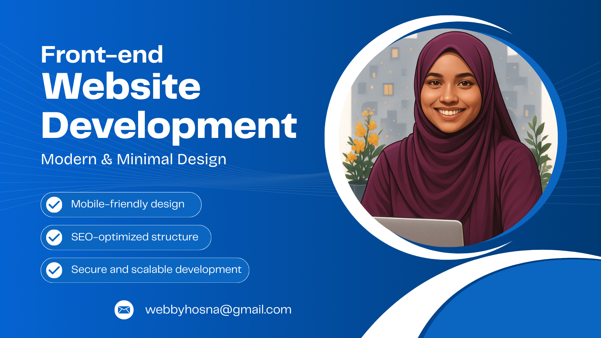

## Hi there, I'm Asma Ul Hosna 👋
### Frontend Web Developer from Bangladesh

### 👩 About Me:
I am a skilled Front-end Web Developer with over 3 years of experience in crafting responsive and visually appealing websites. Proficient in HTML, CSS, JavaScript, and Bootstrap (v4/5), I specialize in transforming design mockups into unique, user-friendly interfaces. I have experience creating a variety of web solutions, including landing pages, portfolios, business sites, restaurants, and e-commerce platforms, all optimized for responsiveness and aesthetic appeal.

### 🚀 My Skills:
- HTML/HTML5, CSS/CSS3
- Bootstrap  
- JavaScript (ES6+), jQuery  
- React  
- Git & GitHub  
- Responsive Design
- SEO Optimization
- Canva for Simple Graphics

### 💻 Projects:
Here are some of my highlighted projects:

- [Portfolio Website fully Responsive](https://webbyhosna.github.io/alisha-zohal-portfolio/)  
- [Responsive Organic Vegetable](https://webbyhosna.github.io/organic_veg/)  
- [Fully Responsive Chips Website](https://webbyhosna.github.io/chips-website/)

👉 You can find more in my [repositories](https://github.com/webbyhosna?tab=repositories).

### 🌐 Connect with me
- Email: webbyhosna@gmail.com  
- LinkedIn: [linkedin.com/in/webbyhosna](https://www.linkedin.com/in/asma-ul-hosna-4a6193367/)
- Facebook: [facebook.com/in/webbyhosna](https://www.facebook.com/webbyhosna)
- Portfolio: -
  
> **“Learning and growing every day — one line of code at a time.”**
